# Prueba_Tecnica

API REST para la gestión de empleados desarrollada con Node.js, Express y MySQL. El sistema permite administrar el ciclo de vida de los empleados mediante operaciones de consulta, creación, actualización y baja lógica, incorporando validaciones, reglas de negocio y auditoría de cambios para mantener la trazabilidad de la información.

## Descripcion del proyecto

Este proyecto implementa el módulo de gestión de empleados mediante una arquitectura por capas (Controller, Service, Repository y Model), con el objetivo de separar responsabilidades, facilitar el mantenimiento y mejorar la escalabilidad del sistema. Incluye validaciones de entrada, reglas de negocio, persistencia de datos en MySQL, trazabilidad de cambios mediante una bitácora de auditoría, un endpoint de salud para monitoreo del servicio, un entorno de ejecución reproducible utilizando Docker y pruebas unitarias ejecutadas automáticamente mediante integración continua con GitHub Actions.

## Tecnologias utilizadas

- Node.js 20: entorno de ejecución principal para el backend y el arranque del servidor desde `src/main/server.js`.
- Express 5: framework utilizado para construir la API REST, definir rutas y manejar middlewares.
- MySQL 9: motor de base de datos relacional donde se almacenan los datos de empleados y la auditoría.
- mysql2: cliente de MySQL utilizado por la capa de conexión y repositorios para ejecutar consultas.
- dotenv: carga de variables de entorno desde el archivo `.env` para la configuración de la aplicación y Docker.
- Docker y Docker Compose: permiten levantar de forma reproducible el entorno completo con MySQL y el backend.
- Node Test Runner: se usa para ejecutar las pruebas unitarias del módulo de empleados.
- GitHub Actions: automatiza la ejecución de pruebas en cada push a la rama `main`.

## Requisitos

- Node.js 20 o superior
- npm 10 o superior
- Docker y Docker Compose si se desea ejecutar el entorno completo con contenedores
- MySQL accesible localmente o mediante Docker

## Instalacion

1. Clona el repositorio.
2. Instala dependencias con `npm install`.
3. Verifica que exista el archivo `.env` en la raiz del proyecto.
4. Si usas Docker, asegúrate de tener Docker Desktop activo antes de levantar los servicios.

## Configuracion

El proyecto usa el archivo `.env` para definir credenciales y parametros de conexion. Las variables esperadas son:

- `MYSQL_ROOT_PASSWORD`
- `MYSQL_DATABASE`
- `MYSQL_USER`
- `MYSQL_PASSWORD`
- `PORT`
- `DB_HOST`
- `DB_PORT`
- `DB_USER`
- `DB_PASSWORD`
- `DB_NAME`

Para ejecucion local sin Docker, `DB_HOST` puede apuntar a `127.0.0.1` y `DB_PORT` al puerto expuesto por tu instancia de MySQL. Dentro de Docker Compose, el backend usa `mysql` como host y `3306` como puerto interno.

## Ejecucion

### Con Node.js

1. Asegura que MySQL este levantado y que el esquema de `database/schema.sql` exista.
2. Ejecuta `npm start`.
3. La API quedara disponible en `http://localhost:3000`.

### Con Docker Compose

1. Ejecuta `docker compose up --build`.
2. MySQL se inicializa con los scripts de `database/`.
3. El backend arranca automaticamente al detectar que la base de datos esta saludable.
4. La API quedara disponible en `http://localhost:3000`.

### Pruebas unitarias

Ejecuta `npm test` para correr la suite completa del backend.

## Endpoints principales

- `GET /health`: Verifica que la API este en ejecucion y responde con un estado general de salud.
- `GET /api/empleados`: Lista empleados con paginacion y filtros opcionales por apellido y estado activo.
- `GET /api/empleados/:id`: Obtiene el detalle de un empleado por su identificador.
- `GET /api/empleados/:id/auditoria`: Devuelve el historial de auditoria asociado al empleado.
- `POST /api/empleados`: Crea un nuevo empleado y registra la operacion en auditoria.
- `PUT /api/empleados/:id`: Actualiza completamente o parcialmente los datos del empleado segun el cuerpo enviado.
- `PATCH /api/empleados/:id/baja`: Marca al empleado como inactivo y registra la baja.

- `GET /api/empleados?apellido=Salazar&activo=true&page=1&limit=5`: Sirve para obtener un listado paginado de empleados que cumplan filtros. En este ejemplo retorna solo empleados activos cuyo apellido contenga `Salazar`, mostrando la pagina 1 con 5 registros por pagina.
- `GET /api/empleados/:id/auditoria`: Sirve para consultar la trazabilidad de cambios de un empleado en particular. Retorna operaciones como inserciones y actualizaciones registradas en bitacora para el `id` indicado.

## Evidencias de funcionamiento

Primero que nada se ve que no hay nada de contenedores encendidos
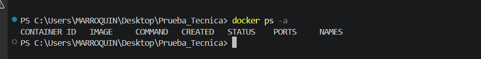

ahora para la verificacion del docker compose se procede a levantarse con docker compose up -d --build
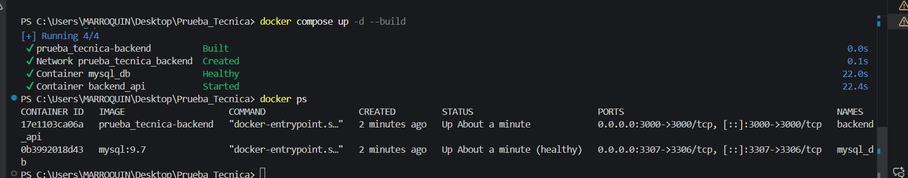
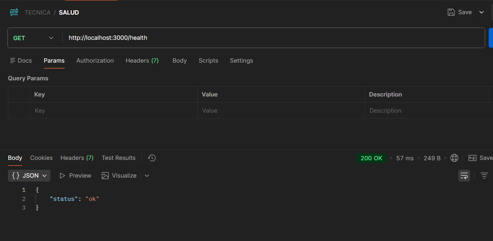

ahora probaremos el funcionamiento del backend con los endpoint

- `GET /api/empleados`

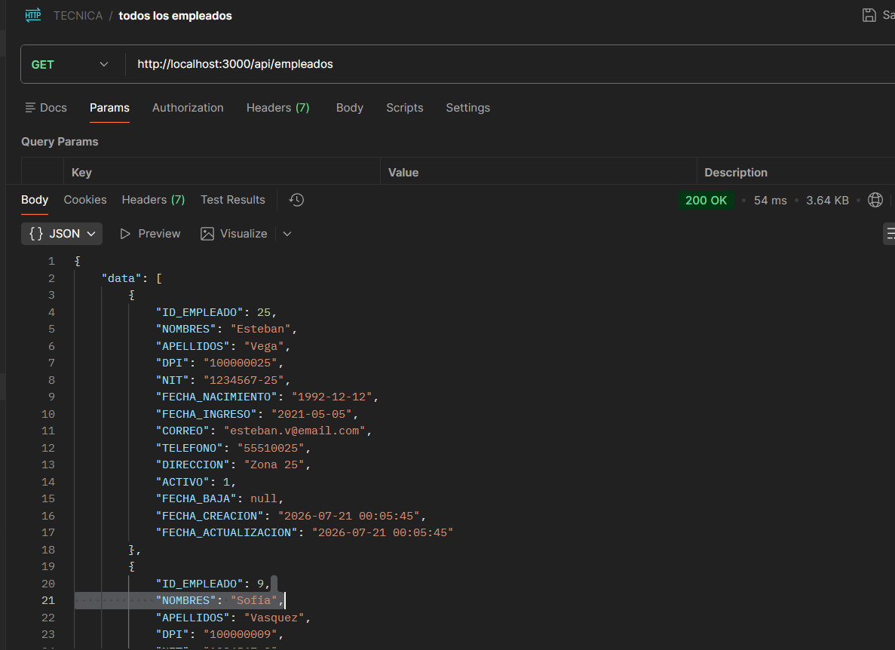

- `GET /api/empleados/:id`

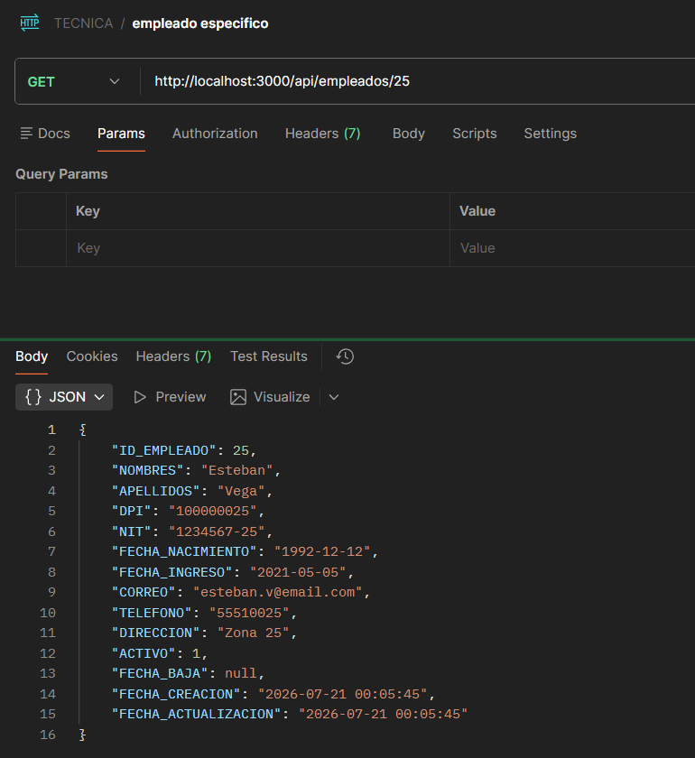

- `POST /api/empleados`

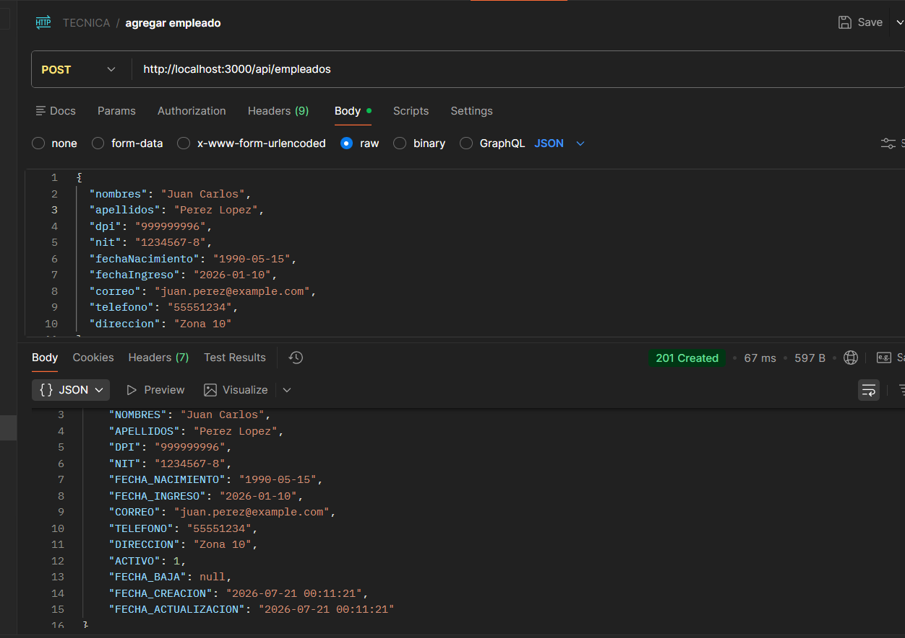

- `PUT /api/empleados/:id`

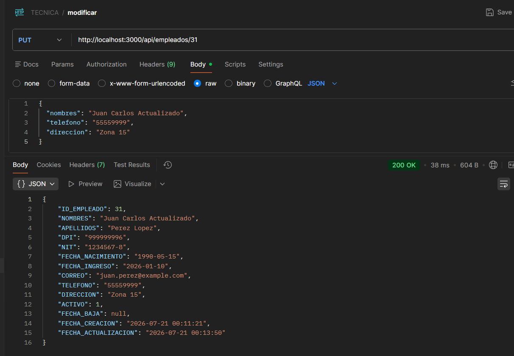

- `PATCH /api/empleados/:id/baja`

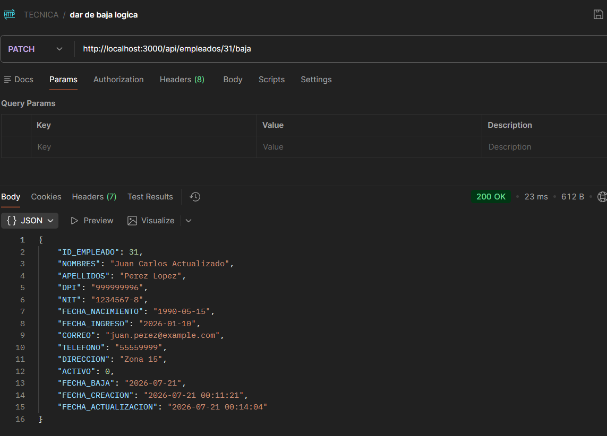

- `GET /api/empleados?apellido=Salazar&activo=true&page=1&limit=5`

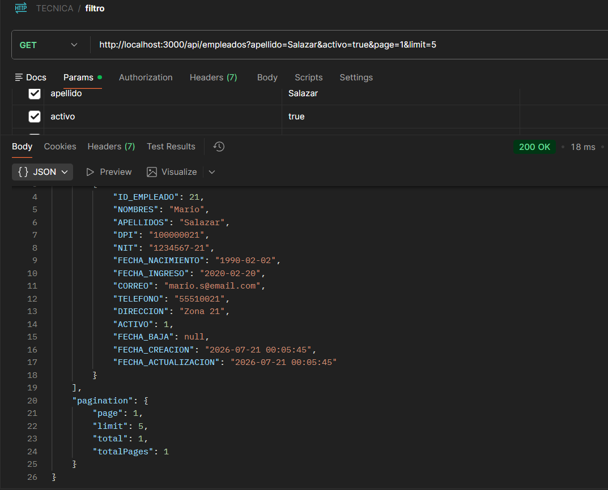

- `GET /api/empleados/:id/auditoria`

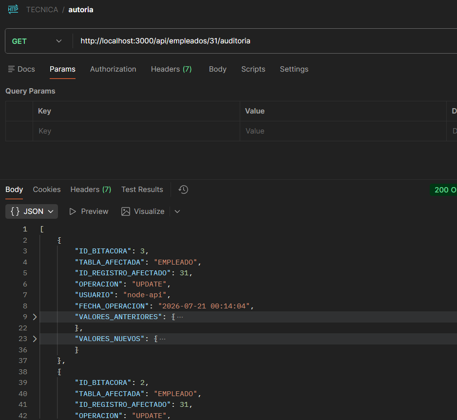

ALGUNAS CONSULTAS

 * Obtener el salario actual de cada empleado.

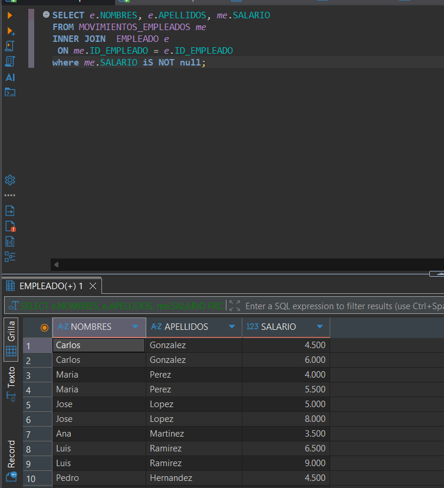

 * Obtener el histórico de salarios de un empleado.

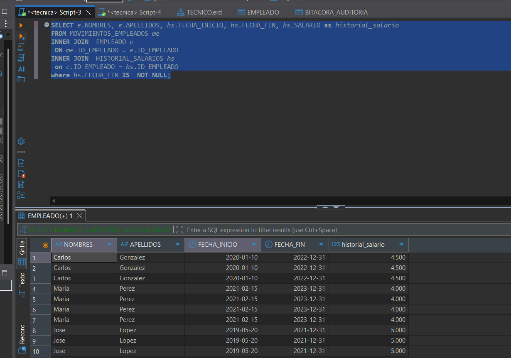

## Decisiones de diseno

- Se uso una arquitectura en capas para separar controladores, servicios, repositorios y modelos.
- El modelo de datos fue normalizado hasta Tercera Forma Normal (3FN) para evitar redundancia y mantener la integridad de la información.
- Se creó una tabla movimientos_empleados para facilitar las consultas solicitadas en la prueba técnica relacionadas con movimientos laborales.
- Docker Compose levanta tanto MySQL como el backend para evitar configuracion manual adicional.
- Se implementó una bitácora de auditoría para registrar las operaciones relevantes realizadas sobre las entidades principales.
- La bitacora de auditoria se considera parte funcional del flujo de empleados y por eso se cubrio con pruebas y rutas.
- Se utilizaron claves primarias numéricas autoincrementales y claves foráneas para garantizar la integridad referencial.
- Se implementaron pruebas unitarias para validar la lógica del backend.
- Se configuró GitHub Actions para ejecutar automáticamente las pruebas unitarias en cada push, aplicando integración continua (CI).

## Supuestos realizados
- Cada empleado puede tener varios contratos a lo largo de su historial, pero únicamente uno puede estar vigente al mismo tiempo.
- Cada empleado pertenece a un único departamento, puesto y unidad organizacional en un momento determinado
- Los cambios de salario, puesto y departamento generan un nuevo registro en sus respectivas tablas de historial sin modificar los registros anteriores.
- La baja de un empleado no elimina sus registros históricos; únicamente cambia su estado a inactivo.
- Para los datos de prueba se asumió una estructura organizacional con cinco departamentos, diez puestos y aproximadamente treinta empleados, siguiendo las recomendaciones del enunciado
- Los salarios se almacenan en moneda local y los cambios quedan registrados con su fecha de vigencia.

## Notas

- El flujo de CI ejecuta `npm test` en cada push a la rama `main`.
- El backend usa el archivo `Dockerfile` para construir la imagen de Node y `.dockerignore` para reducir el contexto de build.